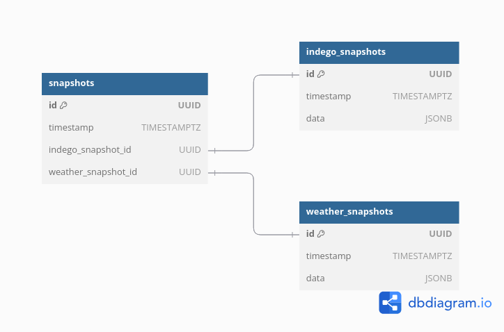
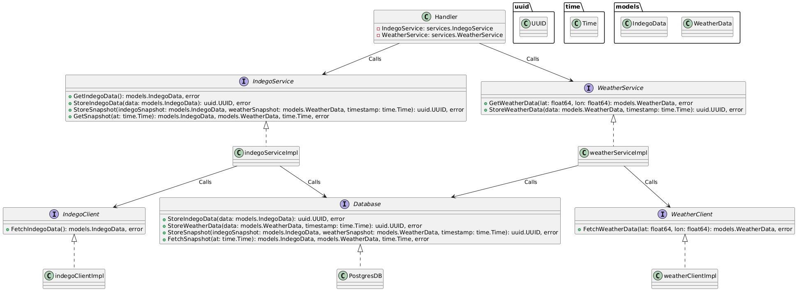

# 1. Overview

The Indego App is designed to collect real-time data from the Indego bike-sharing system and weather services and store this data in a PostgreSQL database. The application uses a layered architecture to ensure separation of concerns, allowing for better maintainability, scalability, and testing. The app is containerized using Docker, enabling easy setup and deployment.

# 2. Key Technologies
- Golang: The backend is built with Go for high performance and scalability.
- Docker: Both the app and the PostgreSQL database are containerized for ease of deployment and isolation.
- PostgreSQL: The relational database stores snapshots of Indego bike data and weather data.
- Auth0: Authentication is managed via Auth0, using OAuth for secure API access.

# 3. Architecture and Design

## 3.1 Migration



Fig 1. DB schema

Migration structure
```
- migration
    |- 001.init.up.sql
    |- 001.init.down.sql
    |- 002.snapshots-links.up.sql
    |- 002.snapshots-lings.down.sql
    |- migrate.go
```
The migration files are named according to a versioning pattern which indicates the order in which the migrations are applied. The up and down suffixes signify the direction of the migration, where up applies changes (migrates forward) and down undoes those changes (rolls back).

Indego snapshots and weather snapshots are stored in separate table with no relationship. The main reason is because weather data and indego data are stand alone data.
A third table is used to link these 2 tables instead so we can still perform independent operations on respective tables.

Key helper functions:

1. `getCurrentMigrationVersion`: Gets the current migration version
2. `getSortedMigrationFiles`: Gets the migration files `.sql` files in ascending version order based on direction.
3. `applyUpMigrations`: Perform all the up migrations.
4. `applyDownMigration`: Performs all the down migrations.
5. `runMigration`: Runs `.sql` scripts
6. `recordMigration`: Increment version in migration table.
7. `removeMigrationRecord`: Decrement version in migration table.


## 3.2 Configuration Management
Configuration is loaded in 2 phases. We first load the configuration yamls. Afterwards, if there is corresponding environment variables, we overwrite the values loaded from yaml.

- config.yaml: The default configuration is stored here and includes server settings, database connection details, API URLs, and authentication configurations.

- Environment variables: Sensitive and environment-specific details like DATABASE_HOST, DATABASE_USER, AUTH0_CLIENT_SECRET, etc., are overridden by environment variables defined in the .env file.

## 3.3 Layered Architecture



Fig 2. Class diagram

The app is structured into distinct layers to ensure separation of concerns. Each layer access another using an interface. The main advantage of doing it this way is that it allows us to switch out multiple components without affecting preceeding layers. 

For example, we can stop using Postgres and use some other DB and we wouldnt have to make much changes. Our new DB simply need to implement DB interface and things will be just fine.

API Layer (HTTP Handlers):
- Routes incoming requests to the appropriate services.
- Includes basic request validation and response formatting.
- Handlers are implemented using Gin.
  
Service Layer:
- Contains the business logic of the application.
- Fetches and processes data from external APIs (Indego & Weather) and interacts with the database via repository functions.
- Services are abstracted via interfaces, allowing for easier mocking in tests.

Data Access Layer (Repository):
- Contains database-related operations (fetch, insert, update).
- SQL queries are written to handle data storage and retrieval in an efficient manner.
  
Gateways:
- Clients for the indego api and weather api

`Bootstrap(main.go)`:
1. Currently, everything is bootstrapped in main.go.
2. Initialise cron job to poll indego and weather data every 1 hour.
   1. Note that the cron job is launched with graceful shutdown (probably not needed but its just personal preference).

# 4. Hitting the API Endpoints
The application provides two ways to authenticate and hit the API endpoints:
1. Auth0 JWT Token: You can obtain a JWT token using the Auth0 credentials, which will be used for all API requests. This method takes priority if both session and token authentication are available.
2. Session-Based Authentication: Alternatively, users can log in via a web browser, which creates a session that can be used for subsequent requests. If a valid session exists, it will automatically be used for authentication.

## 4.1 Using Auth0 JWT Token
To authenticate using Auth0, you must first obtain a JWT token by hitting the Auth0 token endpoint. The obtained token should then be included in the Authorization header for subsequent API requests.

Validating jwt process:
1. Extract Bearer token.
2. Parse the jwt.
3. Retrieve public key dynamically.
   1. JWTs signed by identity providers (like Auth0) are signed using a private key.
   2. The corresponding public key is made available via a JSON Web Key Set(JWKS) endpoint (in this case, hosted by Auth0).
   3. The JWKS structure defines how the public keys are fetched from Auth0. It includes fields like kid (key ID), n (modulus), and e (exponent), which are essential for reconstructing the RSA public key.
   4. This RSA public key is then used to validate the token claims.

## 4.2 Using Session-Based Authentication
If you prefer session-based authentication, you can log in via the browser, which establishes a session for the user. Once authenticated, you can hit the API endpoints without needing to manually pass an access token.

# 5. Docker Setup
The app utilizes multi-stage Docker builds to create a minimal, production-ready container. Two Docker images are created:

Builder Image: Builds the Go binaries for the main application and the migration utility.
Final Image: Contains only the necessary binaries and configuration files for running the app.

# 6. API Documentation and OpenAPI Spec
The API endpoints are documented using Swagger via swaggo. The OpenAPI spec is automatically generated, making it easier for clients to interact with the app.

```
http://localhost:3000/swagger/index.html#/
```

# 7. Functional tests

The functional tests provided are used to verify the overall functionality of the API endpoints in an integrated environment. These tests simulate how the API would behave under real-world scenarios by interacting with the routes.

We mock the following for functional tests:
1. Gateways: both the indego client and weather client
2. db

Since we are sharing mocks across tests, ensure that we reset mocks after each test.
